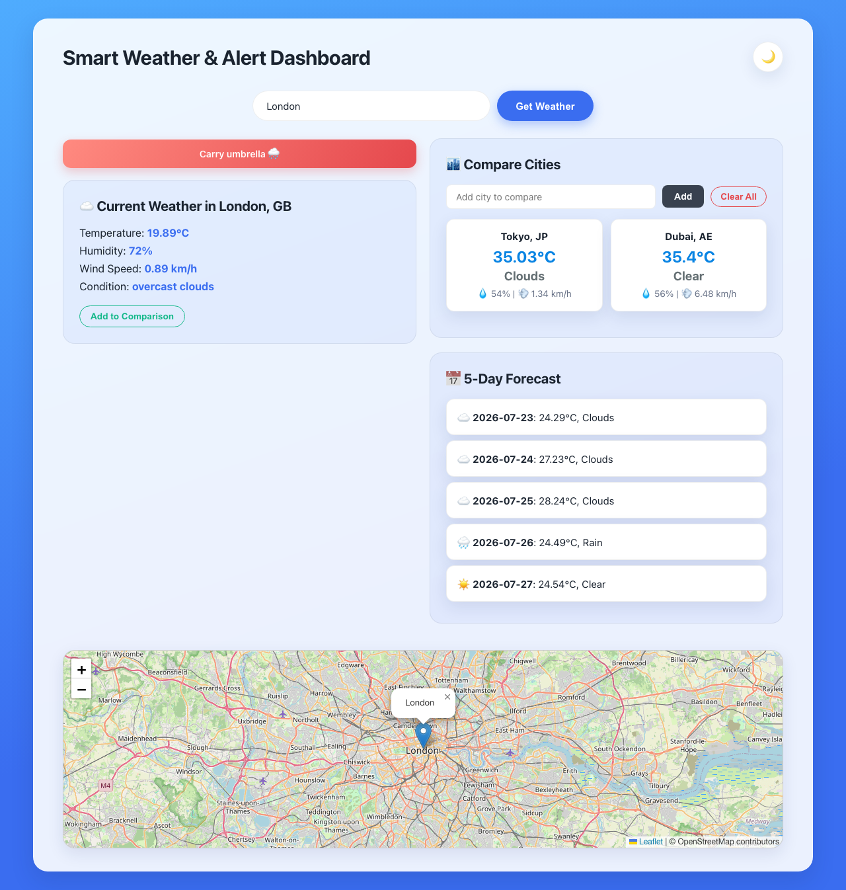
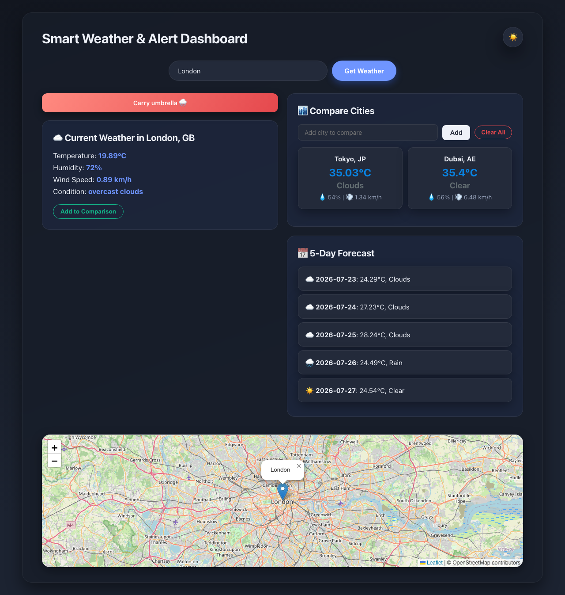

# 🌤️ Smart Weather & Alert Dashboard

A modern, responsive weather dashboard that provides real-time weather information, 5-day forecasts, automated alerts, and interactive maps with city search suggestions.

## 🚀 Live Demo

**🌐 Try it now:** [https://itsharsh007.github.io/wea](https://itsharsh007.github.io/wea)

## 📸 Screenshots

| Light mode | Dark mode |
|---|---|
|  |  |

## ✨ Features

### Core Features
- 🔍 **Smart City Search** - Type-ahead suggestions with popular cities
- 🌡️ **Current Weather** - Real-time temperature, humidity, wind speed, and conditions
- 📅 **5-Day Forecast** - Extended weather predictions
- 🚨 **Smart Alerts** - Automated weather warnings:
  - 🌧️ Rain alert → "Carry umbrella"
  - 🥵 Heat warning → "Stay hydrated" (>35°C)
  - 🌪️ Wind alert → "High winds warning" (>50 km/h)
- 🗺️ **Interactive Map** - Location visualization with Leaflet.js

### Advanced Features
- 🌙 **Dark/Light Theme** - Toggle between themes
- 📱 **Responsive Design** - Works on all devices
- 🏙️ **City Comparison** - Compare weather across multiple cities
- ⚡ **Fast Search** - Instant city suggestions as you type

## 🛠️ Technologies Used

- **Frontend**: HTML5, CSS3, JavaScript (ES6+)
- **Maps**: Leaflet.js with OpenStreetMap
- **API**: OpenWeatherMap API
- **Storage**: LocalStorage for theme preferences
- **Design**: Custom CSS with subtle depth, smooth transitions, and a light/dark theme system

## 🚀 Quick Start

### 1. Clone the Repository
```bash
git clone https://github.com/itsharsh007/wea.git
cd wea
```

### 2. Run Locally
Simply open `index.html` in your browser or use a local server:
```bash
# Using Python
python3 -m http.server 8000

# Using Node.js
npx serve .
```

The app ships with a working OpenWeatherMap key in `script.js` for demo purposes — no setup needed to try it locally.

## 📁 Project Structure

```
wea/
├── index.html          # Main HTML structure
├── style.css            # Styling, theming, and responsive design
├── script.js            # JavaScript functionality
├── screenshots/          # README screenshots
├── README.md             # Project documentation
└── .gitignore            # Git ignore rules
```

## 🔧 Configuration

### Customization Options
- **Units**: Change between metric/imperial in `script.js`
- **City List**: Modify `popularCities` array for different suggestions
- **Theme Colors**: Update the CSS variables at the top of `style.css`
- **Alert Thresholds**: Adjust temperature/wind limits in `displayAlerts()`

## 🌐 Deployment

Deployed via **GitHub Pages** directly from the `main` branch (see the Live Demo link above). To redeploy elsewhere:
- **Netlify**: Drag and drop the folder
- **Vercel**: Connect the GitHub repository
- **Firebase Hosting**: Use the Firebase CLI

## 📱 Browser Support

- ✅ Chrome (recommended)
- ✅ Firefox
- ✅ Safari
- ✅ Edge
- ✅ Mobile browsers

## 🔒 Privacy & Security

- The API key in `script.js` is intentionally public/demo-scoped for this project — this is a static site with no backend, so there's nowhere to hide it. Don't reuse this pattern for a key you need to keep private.
- No personal data is stored or transmitted; only city names/theme preference are cached locally in the browser.

## 🤝 Contributing

1. Fork the repository
2. Create a feature branch: `git checkout -b feature-name`
3. Commit changes: `git commit -m 'Add feature'`
4. Push to branch: `git push origin feature-name`
5. Submit a Pull Request

## 📝 License

This project is licensed under the MIT License - see the [LICENSE](LICENSE) file for details.

## 🙏 Acknowledgments

- [OpenWeatherMap](https://openweathermap.org/) for weather data API
- [Leaflet.js](https://leafletjs.com/) for interactive maps
- [OpenStreetMap](https://www.openstreetmap.org/) for map tiles
